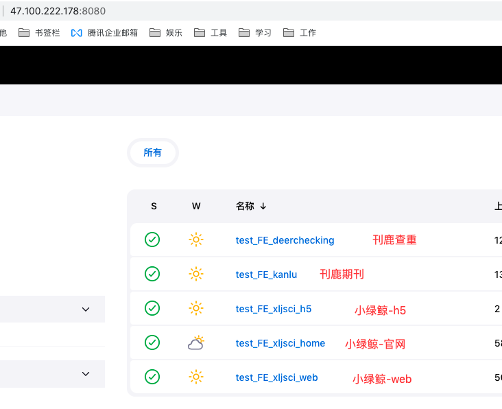
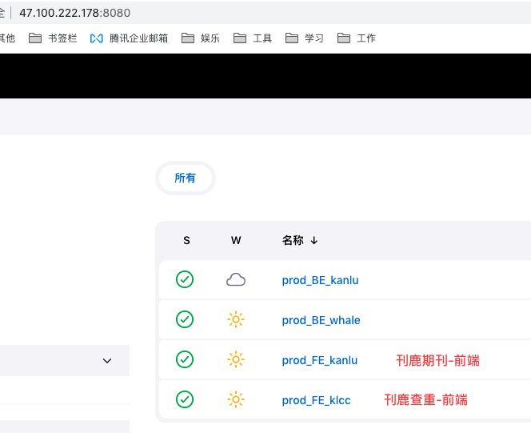

## 刊鹿期刊
* [项目地址](https://codeup.aliyun.com/636f5380801ae2503bb98ddd/lifana/kanlu-pc-ssr)
* [next.js 中文文档](https://www.nextjs.cn/)
* react + ts + mobx + axios + scss + next.js
* 路由会根据项目下第一层的pages生成路由地址
* ssr，通过 getServerSideProps 注入数据，ssr情况下，接口调试不太好调试。
* 请求接口方法可以参考刊鹿期刊、小绿鲸优化一下，目前稍显繁琐
---
* 后端：朱政
* [接口地址](http://47.100.222.178:8085/doc.html#/home)
---
* [测试地址](http://47.100.222.178:3000/) 
  * 测试环境有时候打不开，重新发布一下就可以了
* [线上地址](https://www.klxksci.com/)

## 刊鹿查重
* [项目地址](https://codeup.aliyun.com/636f5380801ae2503bb98ddd/lifana/klcc-web)
* [next.js 中文文档](https://www.nextjs.cn/)
* react + ts + mobx + axios + scss + next.js
* 路由会根据项目下第一层的pages生成路由地址
* ssr，通过 getServerSideProps 注入数据，ssr情况下，接口调试不太好调试。
* 请求接口方法可以参考刊鹿期刊、小绿鲸优化一下，目前稍显繁琐
---
* 后端：王志强
* apifox，下载注册登录，让后端把你加入进去，或者后端会给你网页的apifox
---
* [测试地址](http://47.100.222.178:4000/)
  * 测试环境有时候打不开，重新发布一下就可以了
* [测试地址微信内拉起](http://klcc.medreading.com/)
  * 给测试用来测微信回调用的，开发时候不用这个地址，慢！
* [线上地址](https://www.deerchecking.com/)
---
```
测试地址(http://klcc.medreading.com/) 是暴力发布

外网面板地址: http://101.37.89.21:38808/02604987  
内网面板地址: http://172.16.178.35:38808/02604987  
username: ztrte4ez  
password: 6c5c408c  

登录进入宝塔后，文件菜单，进入klcc，直接把整个项目压缩拉进去，然后解压
```

## 大屏展示
* [项目地址](https://codeup.aliyun.com/636f5380801ae2503bb98ddd/lifana/dashboard)
* react + ts + axios + scss
* 后端：潘志宏
```
http://192.168.10.90:12459/1d62a179
username: ofhbfzuw
password: 44623904

build生成dist文件
登录进入宝塔后，文件菜单，进入dashboard，因为有hash，先删除其他文件，再把生成的dist文件拉进去
```

## 发布地址
* [测试发布地址](http://47.100.222.178:8080/)
  * 账号：frontend
  * 密码：xlj_front
  * 
-------
* [线上发布地址](http://47.100.222.178:8080/)
  * 账号：prod
  * 密码：1t7e8z9Id2fq
  * 

