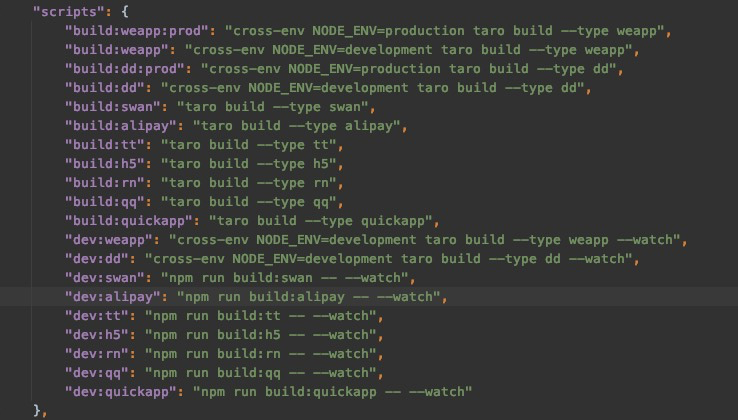
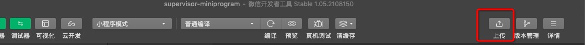
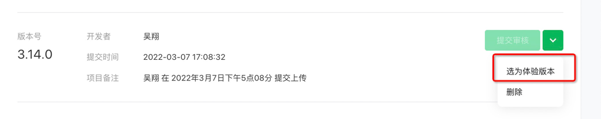
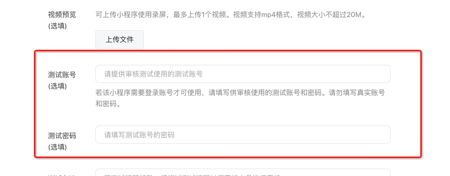
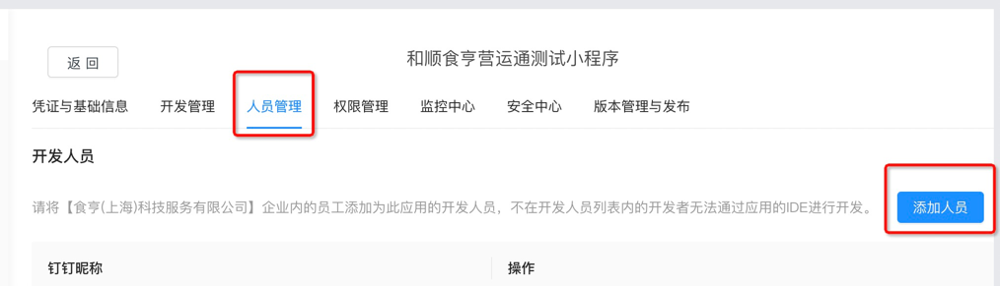
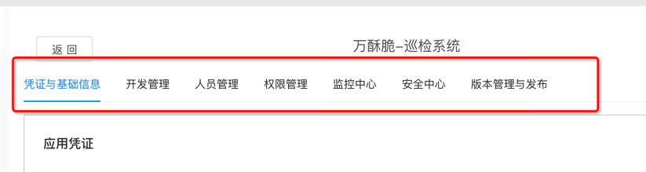
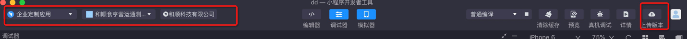
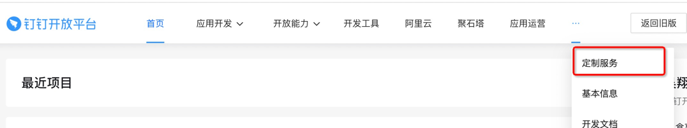
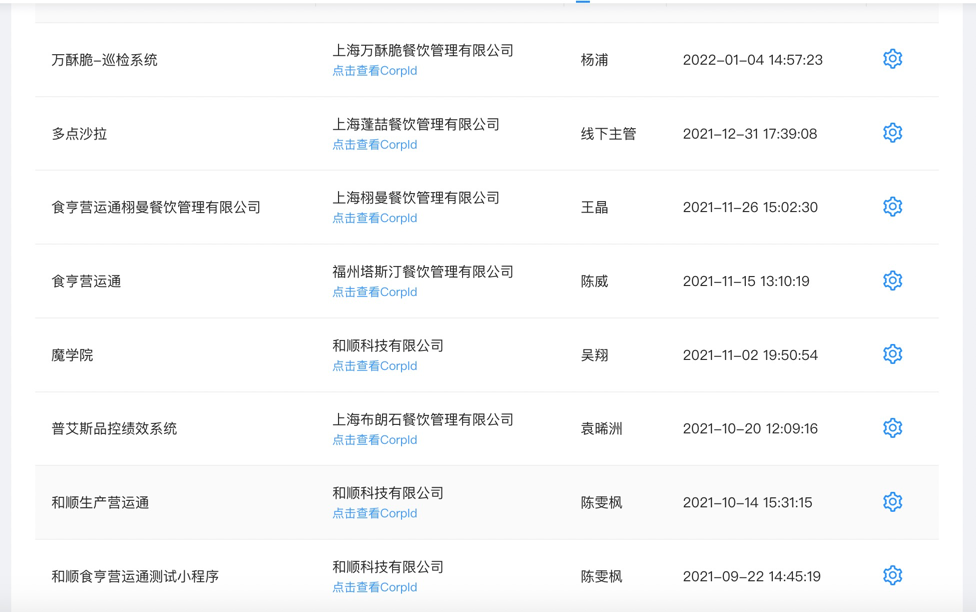
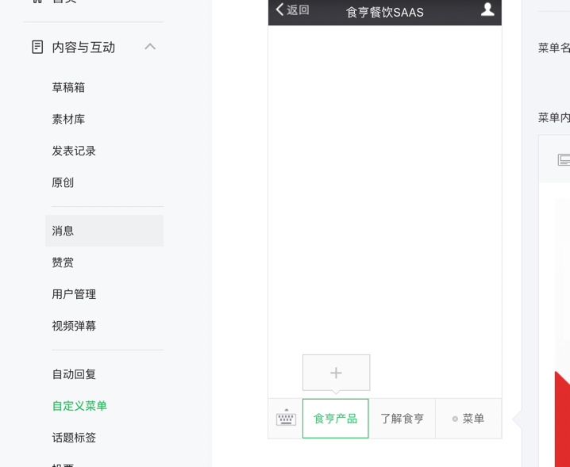

## 小程序（mini-program）

* [开发框架：Taro](https://taro-docs.jd.com/taro/docs/) 
  * 项目开始前需要安装Taro脚手架。
* [css: tailwindcss](https://www.tailwindcss.cn/)
  * 熟悉相应的css类名。项目中看一下对应的配置（`config/tailwind.plugin.js`），看一下读取的自定义配置内容。
* [react文档](https://react.docschina.org/)
* [状态管理: mobx](https://cn.mobx.js.org/)
* [iconfont](https://www.iconfont.cn/?spm=a313x.7781069.1998910419.d4d0a486a)
  * 在项目里使用：在iconfont官网对应的项目维护字体，下载后，替换项目中font下的字体库（src/assets/font），替换对应的class
  （src/iconfont.less）
  
******************************
  
## 打包命令，见系统package.json

******************************

## 微信小程序开发
* 安装[微信小程序开发工具](https://developers.weixin.qq.com/miniprogram/dev/devtools/nightly.html)
* 让产品（Edward）添加为开发人员，设置开发者、运营者（发布权限）
* [微信公众平台](https://mp.weixin.qq.com/) 扫码登录，选择 "食亨营运通"
  * 账号：openplatform03@shihengtech.com
  * 密码：Sh123456.
  * !!!!!有时候发布需要再输入密码
  

###开发流程
* `yarn run dev:weapp`
* 完成需求后，测试环境发到体验版，执行 `yarn run build:weapp`
* 通过微信小程序开发工具上传

* 上传完毕后进入[微信公众平台](https://mp.weixin.qq.com/) ，管理 -> 版本管理 ->在开发版本里选择为体验版

###发布流程
* `yarn run build:weapp:prod`
  * 上传时候可以看一下请求地址，确认是线上地址。
* 通过微信小程序开发工具上传
  
* 上传完毕后进入[微信公众平台](https://mp.weixin.qq.com/) ，管理 -> 版本管理 -> 提交审核
  * 有时候需要填写小程序相关规定，通知一下产品（Edward），让产品填写一下
  * 提交审核时候一般填写测试账号、密码
  * 

******************************

##钉钉小程序
安装[钉钉小程序开发工具](https://open.dingtalk.com/document/resourcedownload/miniapp-tool)  
开发时候选择的是钉钉->企业定制应用
* 让产品（Edward）去找公司的管理员添加为开发人员，成为食亨的开发人员。
* 把对应的开发人加入钉钉人员管理里面

* 品牌商入驻创建，需要他们委托。然后配置，对照其他都填上。（一般情况后端会配置）
  
****
* [钉钉开放平台文档](https://open.dingtalk.com/document/org-roadmap)
* [和顺科技有限公司管理后台](https://oa.dingtalk.com/index.htm#/welcome)
  * 用于测试，邀请。
  
###开发流程
* `yarn run dev:dd`
* 完成需求后，测试环境发到体验版，执行 `yarn run build:dd`
* 通过钉钉小程序开发工具上传，选择对应的应用，测试公司
  
* 然后[开发者后台管理](https://open-dev.dingtalk.com/#/)
* 点击'定制服务'进入项目的发布管理
  
* 选择要发布的公司

###发布流程
* `yarn run build:weapp:dd`
  * 上传时候可以看一下请求地址，确认是线上地址。
* 通过钉钉小程序开发工具上传，选择对应的应用，品牌公司
* 需要发布的品牌
  
  * 魔学院，是第三方开发，我们只需要跳转过去。不是发布内容
  * 和顺生产营运通、和顺食亨营运通测试小程序，在我理解都是测试环境。一个连的是
    线上，一个是测试环境。其他的都需要发布。

******************************

## 公众号

* 找产品（付淑燕）加入公共号开发
* [微信公众平台](https://mp.weixin.qq.com/) 扫码登录，选择 "食亨餐饮SASS"
* 基本上就是h5内嵌，链接跳转。详情见`魔学院.md`
  

